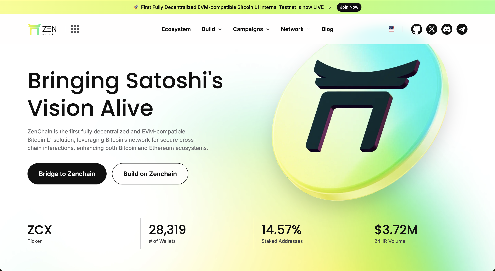

## Zenchain 



ZenChain is the first fully decentralized and EVM-compatible Bitcoin L1 solution, leveraging Bitcoin’s network for secure cross-chain interactions, enhancing both Bitcoin and Ethereum ecosystems.


## Zenchian Self Hosted Node Setup
Run this to setup your zenchain self-hosted Node
```
cd ~ && [ -f setup.sh ] && rm setup.sh; wget https://raw.githubusercontent.com/Widiskel/zenchain-node-guid/refs/heads/master/setup.sh && sudo chmod +x setup.sh && ./setup.sh || echo "Error: Failed to install from setup.sh"
```

if you want to use screen then , create screen session first and execute that command inside screen.


## SUPPORT

Want to support me for creating another node setup ?
**star** my repo or buy me a coffee on

EVM : `0x1f0ea6e0b3590e1ab6c12ea0a24d3d0d9bf7707d`

SOLANA : `3tE3Hs7P2wuRyVxyMD7JSf8JTAmEekdNsQWqAnayE1CN`
